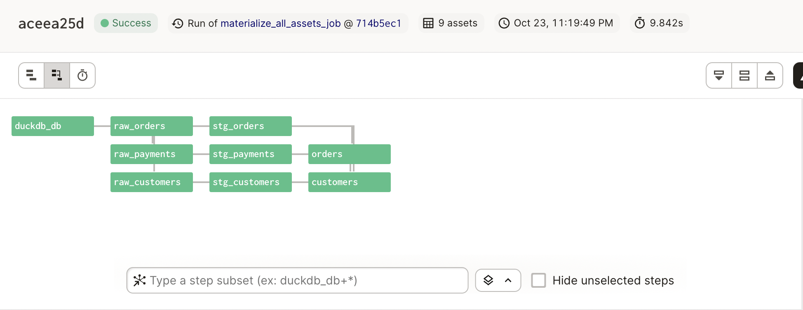

# Dagster's Jaffle Shop

Dagster's Software Defined Assets technology is very cool. It can also be
extremely hard to understand -- not unlike its common partner, dbt.

This repo is intended to help dbt users understand what Dagster assets are,
and how Dagster uses other object classes to declaratively create resources,
in much the same way dbt does.

## dbt _is_ software-defined assets

The core insight this package aims to help users understand is that dbt was
the OG software-defined assets platform for the modern data stack. The beauty
is that dbt made the statement: "you know what, 80% of the highest impact
data work you do can be done simply by writing queries. You give us the SQL,
we'll do the rest."

It's a very neat framework: you just have a directory of SQL files (with Jinja, of
course), and a few "types" of assets like snapshots and seeds and models.

Dagster's software-defined assets framework does not have the benefit of dbt's
simple worldview. But, one could easily rebuild a simple dbt worldview with the
tools provided. That's what I'm doing here, with DuckDB and Dagster.

## Jaffle Shop

The Jaffle Shop repo is a popular starting point for dbt newbies. It's a great
starting point for Dagster noobs too!

What we are going to do here is to:

1. Convert the queries from the dbt jaffle_shop project into assets.
2. Define a custom DuckDB IO Manager that can take a query and write it a db.
3. Write a separate job that can profile the tables (once writen) and log metadata to the asset.

The output graph will look like this:


Here are a few of the opinions this directory adopts:

- All assets live in the dagster_jaffle_shop/assets folder.
- Only one asset is defined per .py file.
- DuckDB assets return a query string. The DuckDB IO Manager renders the Jinja
and executes the query. An alternative would be to have the IO Manager load a
dataframe for each DuckDB asset, and return a dataframe (which it would then
write). This may be a better approach, but it is less "dbt-like", so I'm
passing around query text and table names.

### A typical asset

Here's a definition for a typical asset in this repo:

```{python}
from dagster import asset

from dagster_jaffle_shop.io_managers import duckdb_io_manager


@asset(io_manager_def=duckdb_io_manager)
def stg_foo(some_upstream_asset: str) -> str:
    "An example asset for this custom IO manager."

    jinja_query = """
    with source as (
        select * from {{ some_upstream_asset }}
    ),

    select * from source
    """

    return jinja_query
```

You can see that it's pretty simple: the decorated function is the Python code.
The thing that's returned -- `jinja_query` -- is going to be handled by the IO
Manager. In this case, that IO Manager is going to execute the query against
a DuckDB.



This the magic and complexity of the Dagster asset framework. We could swap out
the IO Manager and have it write this query against Snowflake, BigQuery, S3, or
a Google Document. Essentially, this is what `adapters` are in dbt.

The hard part is that the developer has to be _really_ mindful of what the Python
function is doing, and how the IO Manager will handle it, _and_ how the upstream
assets are going to be rendered within the function. dbt's SQL world has
it easy!

### The asset metadata job

One of the coolest things about Dagster is that it owns the catalog, the asset
definition, and it has a way to log structured metadata in an ad hoc fashion.


It's not hard to imagine a world where you have some package that will profile
all your Snowflake tables on a regular basis and log the info to the asset catalog.
That is essentially what we do here, as a replacement to dbt's YAML-driven
testing framework.

We include two operations:

1. For each table in DuckDB, run `pandas_profiling` against the table.
2. For each defined primary key in a dict, check that all values are null.

The trouble (right now) with Dagster's metadata catalog is that, while you _can_
use a sensor and the event history to do things like, "If you find any events
where an assets metadata key X looks like Y, then send an alert," it's hardly
straightforward. So -- the application of the metadata is still TBD. But you
can see the fundamentals of something really cool are all there.

# Running the package

There are some (hopefully) helpful functions in the Makefile. Docker is giving
me some problems (M1 issues I think) so YMMV if you try to use the Dockerfile
route, but if you have Poetry installed, you should be able to run:

```{bash}
poetry install
poetry run make materialize_job     # runs the asset materialize job from the CLI
poetry run make dagit               # starts up dagit web UI
```

If you don't have Poetry installed, you can use a new virtual environment and
install it there first:

```{bash}
python -m venv .venv
source .venv/bin/activate
pip install poetry==1.2.0
```

Hopefully this works for you!
